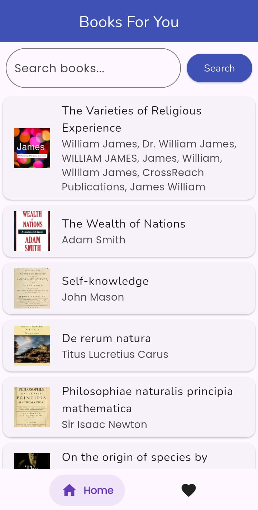
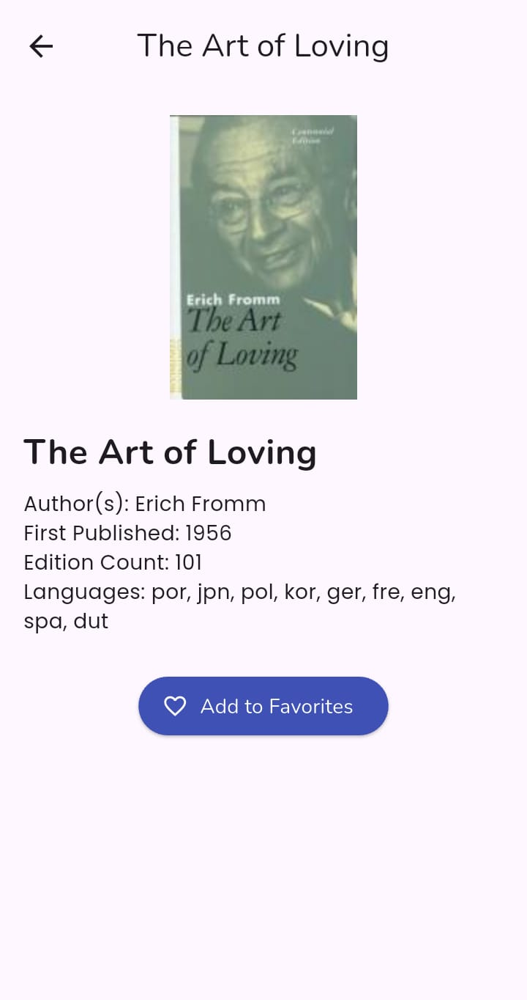
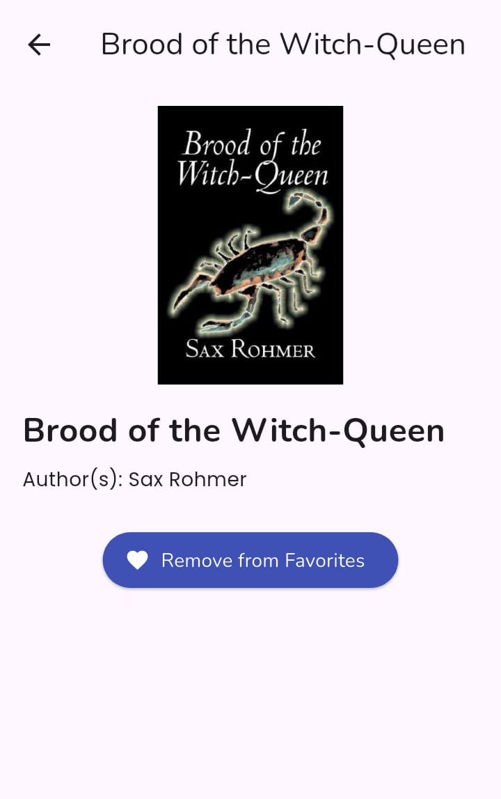
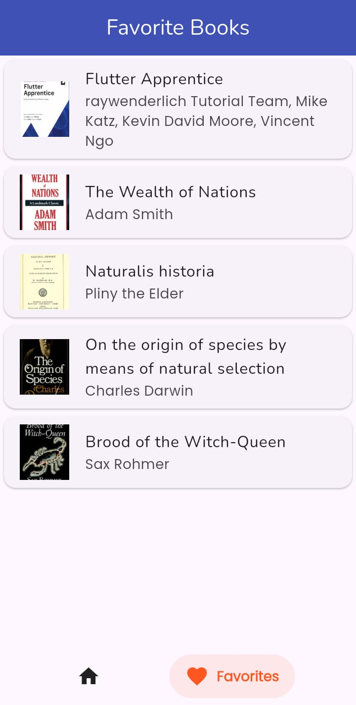

# 📚 Flutter Books App

A cleanly architected Flutter app that fetches a list of books from the Open Library API, supports search, pagination, favorites with SQLite, and a responsive user interface built with BLoC state management.

---

## ✨ Overview

This app allows users to:

- 🔍 Search for books via the [Open Library API](https://openlibrary.org/developers/api)
- 📜 View paginated book listings
- ❤️ Add/remove books from a list of favorites
- 📥 Persist favorites locally using SQLite (`sqflite` package)
- 🔄 Navigate between Home and Favorites with a bottom navigation bar
- 📖 View book details on a separate page

---

## 🏗️ Project Structure (Clean Architecture)

```
lib/
│
├── core/                  # Common utilities (e.g., errors, constants)
├── features/
│   └── books/
│       ├── data/
│       │   ├── models/
│       │   ├── datasources/
│       │   └── repositories/
│       ├── domain/
│       │   ├── entities/
│       │   ├── repositories/
│       │   └── usecases/
│       └── presentation/
│           ├── bloc/
│           ├── pages/
│           └── widgets/
│
├── injection_container.dart
└── main.dart
```

### ✅ Why Clean Architecture?
- Separation of concerns
- Scalable for larger teams/projects
- Testability and maintainability

---

## 📦 Dependencies Used

| Package             | Purpose                                                                 |
|---------------------|-------------------------------------------------------------------------|
| `flutter_bloc`      | For managing app state using BLoC pattern                               |
| `http`              | API calls to fetch books from Open Library                              |
| `equatable`         | Simplifies object comparisons in BLoC states and events                 |
| `sqflite`           | Local persistence for favorite books                                    |
| `path`              | Assists with path operations for SQLite database                        |
| `google_fonts`      | For consistent and beautiful typography                                 |
| `salomon_bottom_bar`| Beautiful animated bottom navigation bar                                |
| `get_it`            | Service locator for dependency injection                                |
| `json_annotation`   | For manual JSON serialization                                           |
| `build_runner`      | For generating JSON serialization boilerplate                           |

---

## 🚀 How to Run the App

### 🔧 Prerequisites
- Flutter SDK installed
- Android/iOS emulator or physical device

### 🛠️ Setup

```bash
git clone https://github.com/your-username/flutter-books-app.git
cd flutter-books-app
flutter pub get
```

### 🔄 Generate Code (if using JSON annotations)

```bash
flutter pub run build_runner build --delete-conflicting-outputs
```

### ▶️ Run App

```bash
flutter run
```

---

## 📦 Build the App

### 📱 Android

```bash
flutter build apk --release
```

### 🍏 iOS

```bash
flutter build ios --release
```

---

## 🙌 Notes for Reviewers

- The app uses **Clean Architecture** with proper separation between `data`, `domain`, and `presentation` layers.
- All use cases are injected using `GetIt`, making the codebase modular and testable.
- `FavoritesBloc` handles add/remove/check logic centrally to avoid state inconsistencies.
- Pagination is implemented via lazy loading as the user scrolls.
- SQLite integration is done via `sqflite`, no external ORM (like Floor) is used to keep the structure lean.

---

## 🔗 API Reference

- [OpenLibrary Search API](https://openlibrary.org/search.json?q=harry+potter)

---

## 📸 Screenshots

### 🔹 Home Screen



### 🔹 Book Detail Page



### 🔹 Favorites Page


---

## 👨‍💻 Author

Developed by Raja Rameez Rauf

---
